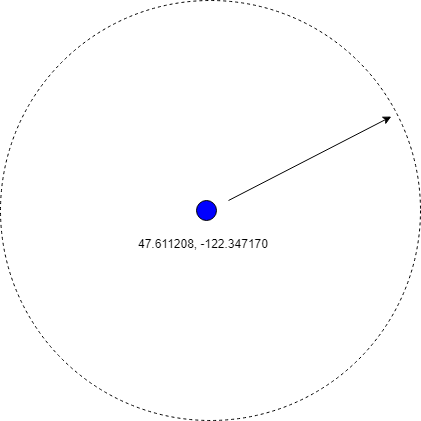
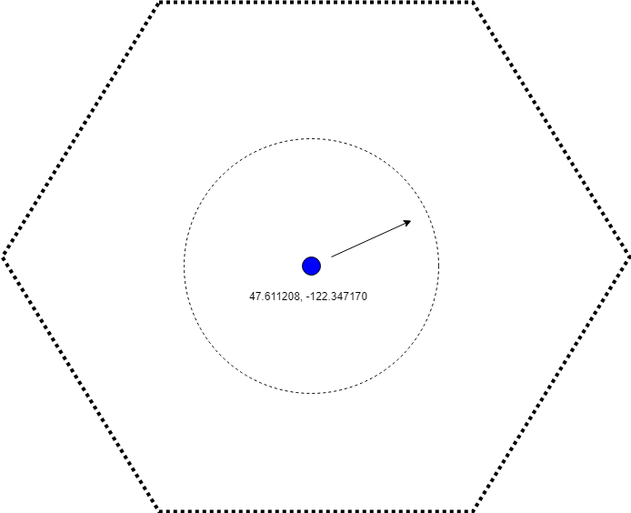

## Building Intelligent GeoSpatial Search Applications with Azure Search

### About this Presentation
Geo-spatial search is prevalent in everyday applications that power our day-to-day lives. In this presentation, you will learn how to use Azure-Search to power geospatial search application. This is a hands-on demo during which you will learn how to do the following operations described below using Postman and then later on walk through an end-to-end multi-tier application that integrates an Angular Web Application, a .NET CORE Web API with an Azure Search backend to demonstrate the full range of geospatial capabilities of Azure Search:

### Goals
- Create an Index
- List all Indicies within the Service
- Load Geospatial Records into an Azure Search Index
- Query for Records within and outside of a specific radius
- Query for Records within and outside of a specific polygon
- Query for Records within a specific distance inside and outside a pre-defined polygon

### Use Cases and Industry Application
During the demo, we will cover some real-world use cases where the geospatial capabilities of Azure Search could come in pretty handy such as tracking of important assets such as cruise ships in the sea, aircrafts, moving trucks and inventory at construction sites.

#### Searching by radius from a specific point

#### Searching by Geospatial fences and closed boundaries

### Presentation Details
Primary Audience: Geo-Spatial Application Developers, Solution Architects.

### Level
The content is designed as an intermediate to advanced level presentation for software engineers, application developers and/or architects.

### Pre-Requisites
- Fundamental working knowledge of Azure Portal and Azure Search
- Fundamental working knowledge of HTML and Angular
- Familiarity with Visual Studio Code and minimum C# knowledge
- Familiarity with Postman
- .NET Core SDK 2.2
- Angular CLI: 7.3.0
- Node: 10.15.1
- Angular: 7.2.4

### Presentation Artifacts

You can use the [post man scripts here](geospatial-search-postman-collection.json) to create an index, add documents to the index and run queries against the index.

### Postman Environment Variables to Define

You will need to define the following variables in your postman environment:
- QueryApiKey
- AdminApiKey
- serviceName
- apiVersion
- indexName

### Contents of the Variables

Variable | Example | Description
--- | --- | ---
*QueryApiKey* | **079D3CCA69A550B2E4D8733F65D89590** | The admin api key for admin operations
*AdminApiKey* | **079D3CCA69A550B2E4D8733F65D89591** | The query api key for read only queries
*serviceName* | **isp20demo** | The name of your Azure Search service
*apiVersion* | **2017-11-11** | The API version you are using
*indexName* | **hotels** | The name of the Azure Search index.

### Relevant Links

#### Downloading and Installing Postman
https://www.getpostman.com/docs/v6/postman/launching_postman/installation_and_updates

#### Setting up Variables in Postman
https://www.getpostman.com/docs/v6/postman/environments_and_globals/variables

#### Creating and Index
https://docs.microsoft.com/en-us/rest/api/searchservice/index-operations

#### Indexing Via REST API
https://docs.microsoft.com/en-us/azure/search/search-import-data-rest-api

#### Supported Data Types
https://docs.microsoft.com/en-us/rest/api/searchservice/supported-data-types

#### Querying the Search Index
https://docs.microsoft.com/en-us/rest/api/searchservice/lucene-query-syntax-in-azure-search

https://docs.microsoft.com/en-us/azure/search/search-query-rest-api

#### Pricing Tiers
https://docs.microsoft.com/en-us/azure/search/search-sku-tier
